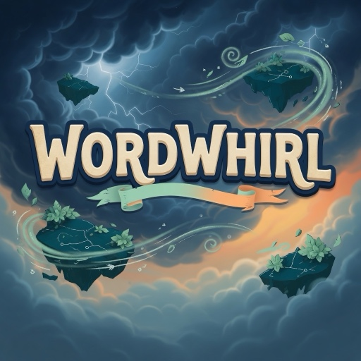
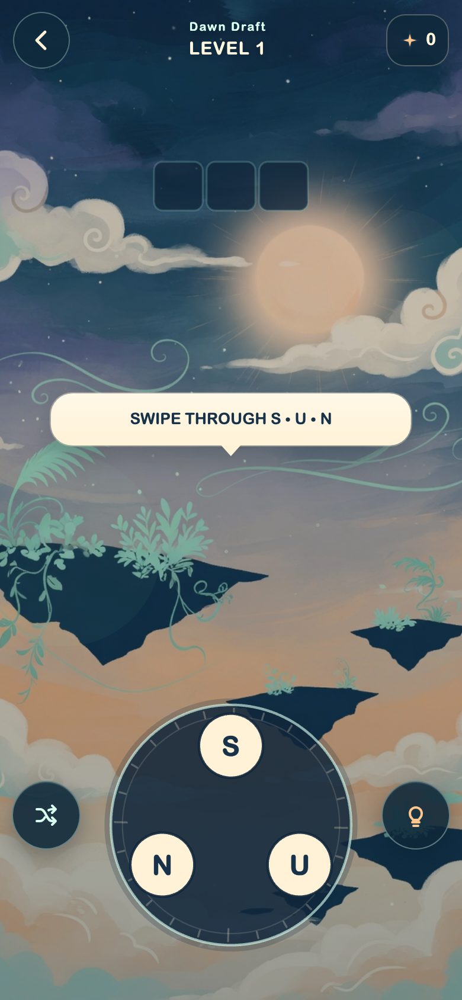

# WORDWHIRL

A portrait swipe-word adventure for RUN.world. Trace the letter compass, fill
the sky-map crossword, collect bonus Sparks, and clear twelve handcrafted
routes.

Built with React 19, PixiJS 8, Vite 6, and RUN SDK 5.24. Rendering is
WebGPU-first with WebGL fallback. Art and audio are generated by project code.

## Store thumbnail

512×512 tile used for RUN store presentation:



## Gameplay

Portrait level view — letter compass, crossword board, and sky backdrop:



## Run locally

```sh
npm install --cache /tmp/wordwhirl-npm-cache
npm run dev
```

Drag across the compass letters or type a word and press Enter. Use
`?screen=main|route|shop|settings|how-to|game|results` for development previews.

## Verify

```sh
npm run check
npm run visual-qa
```

`npm run simulate` proves puzzle solvability and deterministic rewards.
`npm run thumbnail` rebuilds the 512×512 store tile.

## RUN host

The game has not been initialized or deployed. Replace the placeholder
`gameId` through `rundot init`, then upload the checked-in Shop and LiveOps
configs only with owner approval. Real purchases, ads, entitlements, storage,
haptics, and lifecycle events require RUN Playground verification.

Product rules, content, economy, and IDs are canonical in [DESIGN.md](DESIGN.md).
